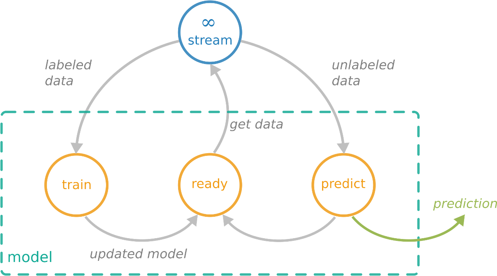

# Practical information

The agenda of the tutorial will be as follows:

* **Place**: Polytechnico di Torino
* **Time**: Friday, September 22nd 2023, afternoon (GMT+1)

# Abstract

With significant advantages upon run time, resource usage, and complexity, online machine learning and stream clustering algorithms are playing a critical role in data science. Besides substantial resource advantages, these algorithms achieve a comparable performance to traditional batch machine learning methods. This tutorial will first surveys online machine learning and data stream clustering. With the emergence of fairness and interpretability, we will also discuss certain attempts in inducing a fair and interpretable machine learning model for data streams. We will then put the tutorial into a practical context with `River`, a Python library resulted from a merge between `Creme` and `scikit-multiflow`. We will also illustrate `River` as a go-to platform for online machine learning development by providing a guidance on how to integrate an algorithm with a clear workflow, alongside actual examples of past problems and solutions during the development process.
    
Besides, during this tutorial, state-of-the-art algorithms, associated core research approaches, and future directions of data stream clustering will be presented. Truly incremental clustering validity indices will also be mentioned as an important part of the stream clustering process and will be investigated thoroughly. Currently available metrics require the information of all past points, which is impractical for unlimited data streams. `River` is the first package to design and deploy such incremental indices. 
    
Last but not least, the tutorial will demonstrate the use of `River` and the associated clustering module in real-world scenarios. From this, we propose methods of clustering configuration, hyper-parameter tuning, applications and settings for benchmarking using real-world problems and datasets. Preliminary benchmarking results will also be provided to showcase the advantages and consistency in the performance of implemented algorithms.

# Two-sentence tutorial description 

*(to be included into the conference registration brochure)*

This tutorial provides an in-depth survey to online (data stream) machine learning, with an emphasis on fairness and interpretability, which is then later put into a practical context with \texttt{River}, a go-to Python library for the task. Moreover, data stream clustering problems will also be further rigorously investigated by mentioning state-of-the-art-algorithms, solutions for the implementation of incremental clustering validity indices, associated core research approaches, and future directions.

# Two-paragraph tutorial description

*(suitable for a web page overview, as per requested by the Call for Tutorials from IJCAI 23)*

With significant advantages upon run time, resource usage, and complexity, online machine learning and stream clustering algorithms are playing a critical role in data science. Besides substantial resource advantages, these algorithms achieve a comparable performance to traditional batch machine learning methods. As such, the first part of this tutorial is devoted as a literature survey into the field, including a strong emphasis on fairness and interpretability, which is then put into a practical context with `River`, a go-to Python library resulted from a merge between `Creme` and `scikit-multiflow`.

Besides, we will also investigate the problem of data stream clustering rigorously with state-of-the-art algorithms, associated core research approaches and future directions. In parallel, we will also look into the design of incremental clustering validity indices, which is an important part of the benchmarking process. All preliminary results will be provided at the end to showcase the advantages and consistency in the performance of implemented algorithms within `River`.

# Motivation

Having algorithms at hand that can process data that arrives continuously in the form of data streams is crucial. 
Online Learning potentially has to deal with real-time data rather than previously known data sets. 
To deal with the evaluation and application of models on data streams, Bifet et al. [5] defined the online learning requirements as follows:
  - Process an instance at a time, and inspect it (at most) once.
  - Use a limited amount of time to process each instance.
  - Use a limited amount of memory.
  - Be ready to give an answer (e.g. prediction) at any time
  - Adapt to temporal changes.

The following figure depicts how an online learning framework is able to comply with the data stream requirements for supervised learning tasks. 
The model processes labeled data points $\left(\overrightarrow{x},y\right)$ by updating the model while instead predicting a label $\hat{y}$ for each unlabeled instance $\overrightarrow{x}$. 
Thus, the model processes each instance from an evolving data stream, updates the underlying model, and is ready to predict at any time. 

Even until now, the development of stream algorithms is quite scattered and decentralized. Previously, algorithms were usually self-developed and maintained by the respective authors in various different programming languages, with none of the existing frameworks being widely adopted within the online learning community. Currently, `River` is becoming not only a go-to library for online machine learning tasks, but also a pioneer framework for the implementation of any new algorithm within the field.

<figure>
  
  <figcaption><strong>Figure 1</strong>: Structure of the interaction between data stream and prediction model.</figcaption>
</figure>

A significant question in the context of the advancement of `River` is whether deep learning algorithms, which have been a staple in many batch learning frameworks for some time, can also fulfill the requirements and therefore be applied within online learning environments. To this end, we developed `deep-river` which combines the `River` API for online learning algorithms and `PyTorch` for the flexible development of neural architectures.
Based on `River` and the newly developed framework `deep-river`, we present in this tutorial the chances and pitfalls for online deep learning by 
- addressing the online learning requirements, 
- the `River` API and discussing their 
- applicability in deep learning architectures. 

The tutorial will cover the transition from simple conventional machine learning models to sophisticated neural architectures while considering not only classification, regression and anomaly detection metrics, but also time and memory consumption which are key factors for the throughput of the underlying model.

# Presenters' bibliography

The following authors will be in-person presenters, i.e., tutors who will attend IJCAI 2023 and present part of the tutorial: **Jacob Montiel**, **Hoang-Anh Ngo**, **Minh-Huong Le-Nguyen** and **Albert Bifet**.

{: .image-left } 

**Jacob Montiel** is currently a Data Scientist in AWS Security. He is formerly a research fellow at the University of Waikato, New Zealand and Adjunct Researcher in the DIG Team at Télécom Paris, Institut Polytechnique de Paris, France and the core developer and maintainer of `River`. 

His research interests are in the field of machine learning for evolving data streams. Prior to focusing on research, Jacob led the development work for onboard software for aircraft and engine’s prognostics at GE Aviation; working in the development of GE’s Brilliant Machines, part of the IoT and GE’s approach to Industrial Big Data.

*Website:* [https://jacobmontiel.github.io/](https://jacobmontiel.github.io/)

*Google Scholar profile:* [Jacob Montiel](https://scholar.google.com/citations?user=WOvISekAAAAJ&hl=en)

 

{: .image-left } 

**Hoang-Anh Ngo** is currently supported by the AI Institute and the School of Computing and Mathematical Sciences, University of Waikato under an External Study Award (ESA) to support his research on `River`, the machine learning library in Python for data streams. 

His research interests lies in the field of machine learning for evolving data stream, particularly in online clustering and classification algorithms. Previously, he joined the team of IT Specialists in COVID-19 task force, formed by the Ministry of Health of Vietnam as a Epidemiological Modelling Unit head.

*Google Scholar profile:* [Hoang-Anh Ngo](https://scholar.google.com/citations?user=yelTvHAAAAAJ&hl=en)

 

{: .image-left } 

**Minh-Huong Le-Nguyen** is a third-year doctoral student at LCTI, Télécom Paris, Institut Polytechnique de Paris in France. Her doctoral research focuses on the applications of machine learning on data streams to implement predictive maintenance in the railway industry. She received her Bachelor’s degree in Computer Science at University Pierre and Marie Curie (France) in 2013, then she graduated from Télécom Paris with a Master’s degree in Data Science in 2019.

*ResearchGate profile:* [Minh-Huong Le-Nguyen](https://www.researchgate.net/profile/Minh-Huong-Le-Nguyen)

 

{: .image-left } 

**Albert Bifet** is a Professor of AI and the DIrector of the Te Ipu o te Mahara AI Institute  at University of Waikato, and Professor of Big Data at Data, Intelligence and Graphs (DIG) LTCI, Télécom Paris. Problems he investigate are motivated by large scale data, the Internet of Things (IoT), and Big Data Science. He co-leads the open source projects MOA (Massive On-line Analysis), Apache SAMOA (Scalable Advanced Massive Online Analysis) and StreamDM.

*Website:* [https://albertbifet.com/](https://albertbifet.com/)

*Google Scholar profile:* [Albert Bifet](https://scholar.google.com/citations?user=UYvAL8EAAAAJ&hl=en)

# Presenters' contact information

### Jacob Montiel

&nbsp; AI Institute, University of Waikato, New Zealand and LCTI, Télécom Paris, Institut Polytechnique de Paris, Frnace

&nbsp; Email: [jmontiel@waikato.ac.nz](mailto:jmontiel@waikato.ac.nz)

### Hoang-Anh Ngo

&nbsp; Artificial Intelligence Institute, University of Waikato, Hamilton, New Zealand

&nbsp; Email: [h.a.ngo@sms.ed.ac.uk](mailto:h.a.ngo@sms.ed.ac.uk)

### Minh-Huong Le Nguyen

&nbsp; LCTI, Télécom Paris, Institut Polytechnique de Paris, France

&nbsp; Email: [minh.lenguyen@telecom-paris.fr](mailto:minh.lenguyen@telecom-paris.fr)

### Albert Bifet

&nbsp; Artificial Intelligence Institute, University of Waikato, Hamilton, New Zealand and LCTI, Télécom Paris, Institut Polytechnique de Paris, France

&nbsp; Email: [abifet@waikato.ac.nz](mailto:abifet@waikato.ac.nz)

# Intended audience

The target audience of the tutorial includes any researchers and practitioners with interests in machine learning for big data, evolving data streams or IoT applications. 

Basic knowledge with the Python programming language would be necessary. Apart from that, there will be no particular requirements or prerequisites on previous experience on data stream learning. However, either experience with traditional machine learning frameworks (`scikit-learn`, `keras`, `pytorch`, etc.) or previous interactions with online machine learning packages/tools, for example `MOA` (in Java), `stream` in `R`, `scikit-multiflow`, `Creme` or `River` in Python, would be beneficial.

For any developer who wants to contribute to `River` or use `River` to employ their own research work, a thorough understanding of `Git`, functionalities of `GitHub` (how to open a pull request, an issue, a discussion, Github Actions, etc.), code formatters in Python (`flake8`, `black`, `isort`, etc.) would be necessary.

# Format and detailed schedule

The tutorial is intended to be of **3.5 hours** (half-day, consisting of **two 1:45h slots**), spread throughout **3 sections** with **two 15-minute breaks** between each section. The detailed outline of the tutorial is as follows:

1. Introduction to data stream (online) machine learning (**1 hour**):
    1. What is online machine learning, and why do we need online machine learning?
    1. Differences, advantages and disadvantages of online machine learning compared to batch/traditional machine learning.
    1. Methods and interventions to induce fairness and interpretability in machine learning for streaming data in general.
    1. Introduction to `River`:
        1. Its foundation as a merge between `Creme` and `scikit-multiflow`;
        1. Design principles;
        1. Major advantages of `River` towards its competitors;
        1. Major updates/improvements throughout the versions.
    1. A brief guidance on how to develop/implement a model within `River`, along with demo and examples of past problems and solutions within the development process.
    1. Future maintenance and development orientation for `River`.
1. Online clustering algorithms and evaluation metrics (`1 hour 15 minutes`):
    1. A literature survey on existing clustering algorithms, the general concepts, approaches and their evolution.
    1. Introduction to the state-of-the-art clustering algorithms implemented in `River` and their potential differences or advantages compared to previously implemented versions.
    1. How to improve accuracy in calculating micro-cluster centers and diameters through time using Welford's algorithm.
    1. An investigation into currently available static validity indices, arising problems and motivation for the foundation of their truly incremental versions.
    1. A comparative survey on the expansion of incremental clustering validity indices, particularly among the most significant and widely used one that are adapted and integrated to `River`.
    1. `textClust`, the first text clustering algorithm to be implemented in `River`.
    1. A brief introduction to research on fairness and interpretability of data stream clustering algorithms.
    1. Potential future research directions towards improvement in time and accuracy of stream clustering.
1. Use cases and benchmarking (**45 minutes**):
    1. Practical applications.
    1. Comparison between online and traditional/batch clustering algorithms.
    1. Live visualization of stream algorithms and their results in synthetic and real-life scenarios.
    1. Motivation, setting and system requirements for conducting benchmarking.
    1. Tutorial on benchmarking using the River package and the associated available `git` repository and terminal.
    1. Preliminary benchmarking results.

# Brief outline

## Introduction to data stream machine learning

This first part is intended to provide the motivation and necessity of online stream learning. As a matter of fact, traditional machine learning methods can not deal with an particularly large amount of data with limited resources and time constrains, which means that there is an urgent need for specific data stream machine learning methods with comparable results. 

Besides providing insights on advantages and disadvantages of online machine learning, we will also provide an introduction to `River`, a Python library aimed to become a go-to toolkit for this purpose with numerous advantages and features towards its open source competitors. Not only will we present `River` as a tool, we will also provide a detailed guide on how to contribute to `River` or utilize `River` to facilitate participants' own research works.

To conclude this section,  we present the latest trends in research for fairness and interpretability of stream machine learning models. Having to handle an unlimited amount of data while having to maintain the accuracy under concept drifts, the research for a fair and interpretable AI is interesting, yet much more demanding compared to that of traditional machine learning models.

## A literature survey on online clustering algorithms and metrics

This part will first start with an extensive survey on online clustering algorithms. First, we will start with the development from the first algorithms that introduced the concept of micro-clusters/macro-clusters and online/offline phases (BIRCH/CluStream), then to the evolution based on different approaches. These approaches include either distance-based, grid-based, model-based or projected, two-phase, type of time windows (damped, sliding, landmark or pyramidal), or the use of medoids/centroids. Besides interpreting these approaches, respective algorithms and their implementations within `River` are also introduced, including KMeans, DenStream, DBStream, STREAMKMeans and EvoStream.

With the emerging research on fairness and interpretability of AI, we will also discuss certain attempts in inducing a fair and interpretable stream clustering algorithm, including

- The first attempts for a fair K-Means algorithm by Schmidt et al. (2018) \cite{DBLP:journals/corr/abs-1812-10854} or fair k-Center algorithm by Bera et al. (2022) \cite{10.1145/3485447.3512188} have been introduced.
- Intepretable multiple data stream clustering with clipped stream representation has also been proposed by Laurinec and Lucká (2019) \cite{10.1007/s10618-018-0598-2}.

From this, we will discuss their effectiveness and later on how to apply these certain approaches for a broader family of clustering algorithms.

Finally, one aspect of online clustering algorithms that are usually neglected is the use of incremental validation metrics. Currently, apart from `River`, there is no tool/package that facilitates the use of truly incremental metrics, i.e. metrics that only use the summary statistics and the latest observation instead of having to use information of all passed points, which is impractical in stream learning. As such, in this part, we will also focus on the construction and comparison between these metrics, and also how to apply them in analyzing clustering algorithms' performances when put into practice.

## Practical applications and benchmarking using the clustering module of `River`

The final part serves as a practical demonstration on the usage of `River` and the associated clustering module in real-life scenarios.

First, a brief demonstration of `River` will be presented and its essential functionalities will also be compared with respective traditional/batch machine learning algorithms in terms of performance, memory and time usage to prove that although online methods takes up less resources, they have the ability to obtain a similar accuracy.

The next part will be dedicated to stream clustering algorithm's benchmarking work. The setting, system requirement, benchmarking method and hyper-parameter tuning will all be discussed.

Last but not least, preliminary benchmarking results with dedicated datasets will also be provided to exhibit the advantages and consistency in the performance of implemented algorithms.

# Type of support material to be supplied to attendees

Participants will receive the following support material:
  
- Presentation slides;
- PDF versions (including results) of any quizzes and surveys within the tutorial;
- All Jupyter notebooks and demos executed within and/or related to the tutorial.

Apart from the printed materials, the electronic version will all be freely, publicly available on the dedicated tutorial's website.

# List of previous offerings of the tutorial and relationship with them

## List of previous offerings of the tutorial

There has been two previous offerings of similar tutorials on the topic at highly-ranked conferences, including:

- First offering:
  - **Title:** Online Clustering: Algorithms, Evaluation, Metrics, Applications and Benchmarking using `River`.
  - **Conference:** The 26th Pacific - Asia Conference on Knowledge Discovery and Data Mining (PAKDD 2022).
  - **Number of participants:**} Unknown. Due to the COVID-19 prevention measures and time differences, the tutorial is presented online with a pre-recorded video.    
- Second offering:
  - **Title:** Online Clustering: Online Clustering: Algorithms, Evaluation, Metrics, Applications and Benchmarking \cite{10.1145/3534678.3542600}.
  - **Conference:** The 28th ACM SIGKDD Cofnerence on Knowledge Discovery and Data Mining (KDD '22).
  - **Content:** Publicly available within \href[the tutorial's website](https://hoanganhngo610.github.io/river-clustering.kdd.2022/) and [the conference's proceedings](https://dl.acm.org/doi/10.1145/3534678.3542600).
  - **Number of participants:** Approximately 50 participants.

## Relationship to previous editions

### Similarities

This tutorial will preserve its strong points from previous editions by
  - providing a deep, thorough literature survey of state-of-the-art stream clustering algorithms and future research directions; and
  - allowing participants to have essential understanding of online learning, put under a practical point of view by `River`. Moreover, they will also be provided with interactive  demonstration that simulates real-life scenarios.

### Differences

The main differences of this tutorial compared to its previous versions are:

  - First and foremost, this tutorial will be more developer-oriented. This means that, apart from providing guidance and use cases `River`, the authors also provide a detailed picture of the developing process and how to contribute/develop a user's own algorithm within the ecosystem, along with actual problems and solutions during the development process. This is expected to potentially solve the problem of scattered and unorganized implementation of currently available stream clustering algorithms. 
  - On top of that, a clear development and maintenance orientation under the form of a public roadmap will also be provided. This can be considered as one of the most crucial parts in the development of any open-source projects.
  - The tutorial will also tackle the problems and provide detailed insights as a literature review of fairness and interpretability of online machine learning algorithms in general and stream clustering algorithms in particular. This part is intended to address a comment on the tutorial offering at KDD'22. Moreover, this will also be the first tutorial to ever conduct a survey into this aspect of online machine learning.
  - This tutorial will also be the first to analyze the implementation strategy of truly incremental clustering metrics in `River`, which are not available in any other online machine learning tools/packages.
  - Apart from providing a guidance on how to conduct benchmarking with `River`, preliminary results for comparison will also be provided. This work has just been completed recently and were not provided within any previous editions of this tutorial.
  - The tutorial will also introduce a starting solution to new research pathways in stream clustering algorithms:
    - Text clustering algorithms (despite the fact that previously, text clustering can be done with an indirect approach, using Term Frequency - Inverse Document Frequency (TF-IDF) \cite{rajaraman_ullman_2011} with an arbitrary numerical stream clustering algorithm;
    - Improvement in accuracy of calculating micro-clusters' centers and diameters using Welford's algorithm \cite{10.1007/978-3-642-51461-6_3} instead of cluster feature vectors.

# Strategies to enhance audience and interactivity

Since it is intended to be a mix between a lecture-style and a practical-style tutorial, the authors intend to imply various strategies to enhance interaction and interest, including:

- Including various small Question and Answers sessions in the tutorial to enhance speaker - audience interaction, ideally once after every finished section;
- Interactive quizzes or surveys (e.g. quizzes hosted on [kahoot](https://www.kahoot.it) will also be useful in attracting attendance and making the atmosphere more relaxed, while, at the same time, they can also make sure that the audience can understand the content conveyed;
- Using interactive tools like Jupyter notebooks with `Holoviews` or `Plotly` to represent real-time results for the purpose of visualisation;
- Switching presenters on-the-go, not necessarily after each section, will significantly increase attendees' attention towards the tutorial;
- Instead of pre-filling all code snippets, a lot of tasks within the demo will be left blank so that users can try to have a practical experience with all parts, either within or after the tutorial. Having all tools, packages and frameworks open-source (including `River` and the associated demo repository) is also a plus in facilitating this practice.
- Organizing small coding challenges or competitions. Since the main theme of the practical part of this tutorial is live visualisation and benchmarking, a certain level of competitiveness would create an energetic and enjoyable environment.

# Ethical statement

There are no ethical concerns related to the topic of this tutorial.

# Related materials

For all related materials, including presentation slides, demos, source code, related papers and any other piece of information, please visit [this page](./related-materials.html).

# Citation

TBA

# References

1. Martin Abadi, Andy Chu, Ian Goodfellow, H. Brendan McMahan, Ilya Mironov, Kunal Talwar, and Li Zhang. Deep Learning with Differential Privacy. In *Proceedings of the 2016 ACM SIGSAC Conference on Computer and Communications Security*, CCS ’16, pages 308–318, New York, NY, USA, October 2016. Association for Computing Machinery.
1. Rahaf Aljundi, Lucas Caccia, Eugene Belilovsky, Massimo Caccia, Min Lin, Laurent Charlin, and Tinne Tuytelaars. Online Continual Learning with Maximally Interfered Retrieval, October 2019.
1. Rahaf Aljundi, Min Lin, Baptiste Goujaud, and Yoshua Bengio. Gradient based sample selection for online continual learning, October 2019.
1. Atilim Gunes Baydin, Robert Cornish, David Martínez-Rubio, Mark Schmidt, and Frank Wood. Online learning rate adaptation with hyper-gradient descent. In *6th international conference on learning representations, ICLR 2018, vancouver, BC, canada, april 30 - may 3, 2018, conference track proceedings*. OpenReview.net, 2018. tex.bibsource: dblp computer science bibliography, [https://dblp.org](https://dblp.org) tex.biburl: [https://dblp.org/rec/conf/iclr/BaydinCMSW18.bib](https://dblp.org/rec/conf/iclr/BaydinCMSW18.bib) tex.timestamp: Thu, 23 Apr 2020 11:53:22 +0200.
1. Albert Bifet, Ricard Gavaldà, Geoff Holmes, and Bernhard Pfahringer. *Machine Learning for Data Streams with Practical Examples in MOA*. MIT Press, 2018.
1. Nadia Burkart and Marco F. Huber. A Survey on the Explainability of Supervised Machine Learning. *Journal of Artificial Intelligence Research*, 70:245–317, January 2021.
1. Pietro Buzzega, Matteo Boschini, Angelo Porrello, Davide Abati, and Simone Calderara. Dark Experience for General Continual Learning: A Strong, Simple Baseline, October 2020.
1. Nicholas Carlini and David Wagner. Towards Evaluating the Robustness of Neural Networks. In *2017 IEEE Symposium on Security and Privacy (SP)*, pages 39–57, May 2017.
1. Jacob Devlin, Ming-Wei Chang, Kenton Lee, and Kristina Toutanova. BERT: Pre-training of Deep Bidirectional Transformers for Language Understanding. In *Proceedings of the 2019 Conference of the North American Chapter of the Association for Computational Linguistics: Human Language Technologies, Volume 1 (Long and Short Papers)*, pages 4171–4186, Minneapolis, Minnesota, June 2019. Association for Computational Linguistics.
1. João Gama, Pedro Medas, Gladys Castillo, and Pedro Rodrigues. Learning with drift detection. In Ana L. C. Bazzan and Sofiane Labidi, editors, *Advances in Artificial Intelligence – SBIA 2004*, pages 286–295, Berlin, Heidelberg, 2004. Springer Berlin Heidelberg.
1. Heitor Murilo Gomes, Jesse Read, and Albert Bifet. Streaming random patches for evolving data stream classification. In *2019 IEEE International Conference on Data Mining (ICDM)*, pages 240–249, 2019.
1. Heitor Murilo Gomes, Jesse Read, Albert Bifet, Jean Paul Barddal, and João Gama. Machine learning for streaming data: State of the art, challenges, and opportunities. *SIGKDD Explor. Newsl.*, 21(2):6–22, nov 2019.
1. Max Halford, Geoffrey Bolmier, Raphael Sourty, Robin Vaysse, and Adil Zouitine. creme, a Python library for online machine learning, 2019.
1. Kaiming He, Xinlei Chen, Saining Xie, Yanghao Li, Piotr Dollar, and Ross Girshick. Masked Autoencoders Are Scalable Vision Learners. In *2022 IEEE/CVF Conference on Computer Vision and Pattern Recognition (CVPR)*, pages 15979–15988, New Orleans, LA, USA, June 2022. IEEE.
1. Steven C. H. Hoi, Doyen Sahoo, Jing Lu, and Peilin Zhao. Online Learning: A Comprehensive Survey, October 2018.
1. Kurt Hornik, Maxwell Stinchcombe, and Halbert White. Multilayer feedforward networks are universal approximators. *Neural Networks*, 2(5):359–366, January 1989.
1. Lakhmi C. Jain, Manjeevan Seera, Chee Peng Lim, and P. Balasubramaniam. A review of online learning in supervised neural networks. *Neural Computing and Applications*, 25(3-4):491–509, September 2014.
1. James Kirkpatrick, Razvan Pascanu, Neil Rabinowitz, Joel Veness, Guillaume Desjardins, Andrei A. Rusu, Kieran Milan, John Quan, Tiago Ramalho, Agnieszka Grabska-Barwinska, Demis Hassabis, Claudia Clopath, Dharshan Kumaran, and Raia Hadsell. Overcoming catastrophic forgetting in neural networks. *Proceedings of the National Academy of Sciences*, 114(13):3521–3526, March 2017.
1. Alex Krizhevsky, Ilya Sutskever, and Geoffrey E Hinton. ImageNet Classification with Deep Convolutional Neural Networks. In *Advances in Neural Information Processing Systems*, volume 25. Curran Associates, Inc., 2012.
1. Zhizhong Li and Derek Hoiem. Learning without Forgetting. *IEEE Transactions on Pattern Analysis and Machine Intelligence*, 40(12):2935–2947, December 2018.
1. Jesus L Lobo, Javier Del Ser, Albert Bifet, and Nikola Kasabov. Spiking neural networks and online learning: An overview and perspectives. *Neural Networks*, 121:88–100, 2020. Publisher: Elsevier.
1. Scott Lundberg and Su-In Lee. A Unified Approach to Interpreting Model Predictions, November 2017.
1. Aleksander Madry, Aleksandar Makelov, Ludwig Schmidt, Dimitris Tsipras, and Adrian Vladu. Towards Deep Learning Models Resistant to Adversarial Attacks, September 2019.
1. Michael McCloskey and Neal J. Cohen. Catastrophic Interference in Connectionist Networks: The Sequential Learning Problem. In *Psychology of Learning and Motivation*, volume 24, pages 109–165. Elsevier, 1989.
1. Jacob Montiel, Jesse Read, Albert Bifet, and Talel Abdessalem. Scikit-multiflow: A multi-output streaming framework. *Journal of Machine Learning Research*, 19(72):1–5, 2018.
1. Jacob Montiel, Max Halford, Saulo Martiello Mastelini, Geoffrey Bolmier, Raphael Sourty, Robin Vaysse, Adil Zouitine, Heitor Murilo Gomes, Jesse Read, Talel Abdessalem, and Albert Bifet. River: machine learning for streaming data in python. *Journal of Machine Learning Research*, 22:1–8, April 2021. 
1. Jacob Montiel, Hoang-Anh Ngo, Minh-Huong Le-Nguyen, and Albert Bifet. Online clustering: Algorithms, evaluation, metrics, applications and benchmarking. In *Proceedings of the 28th ACM SIGKDD Conference on Knowledge Discovery and Data Mining*, KDD ’22, page 4808–4809, New York, NY, USA, 2022. Association for Computing Machinery. 
1. Jordan Pearson and Yoshua Bengio. When AI Goes Wrong, We Won’t Be Able to Ask It Why, July 2016. 
1. Anand Rajaraman and Jeffrey David Ullman. *Data Mining*, page 1–17. Cambridge University Press, 2011. 
1. Marco Tulio Ribeiro, Sameer Singh, and Carlos Guestrin. ”Why Should I Trust You?”: Explaining the Predictions of Any Classifier, August 2016. 
1. David E. Rumelhart, Geoffrey E. Hinton, and Ronald J. Williams. Learning representations by back-propagating errors. *Nature*, 323(6088):533–536, October 1986. 
1. Doyen Sahoo, Quang Pham, Jing Lu, and Steven C. H. Hoi. Online Deep Learning: Learning Deep Neural Networks on the Fly. In *IJCAI Proceedings*, pages 2660–2666, Stockholm, Sweden, July 2018. International Joint Conferences on Artificial Intelligence Organization. 
1. Sheng Wan and L.E. Banta. Parameter Incremental Learning Algorithm for Neural Networks. IEEE *Transactions on Neural Networks*, 17(6):1424–1438, November 2006. 
1. Jonathan A. Silva, Elaine R. Faria, Rodrigo C. Barros, Eduardo R. Hruschka, Andr ́e C. P. L. F. de Carvalho, and João Gama. Data stream clustering: A survey. *ACM Comput. Surv.*, 46(1), jul 2013. 
1. David Silver, Aja Huang, Chris J. Maddison, Arthur Guez, Laurent Sifre, George van den Driessche, Julian Schrittwieser, Ioannis Antonoglou, Veda Panneershelvam, Marc Lanctot, Sander Dieleman, Dominik Grewe, John Nham, Nal Kalchbrenner, Ilya Sutskever, Timothy Lillicrap, Madeleine Leach, Koray Kavukcuoglu, Thore Graepel, and Demis Hassabis. Mastering the game of Go with deep neural networks and tree search. *Nature*, 529(7587):484–489, January 2016. 
1. Christian Szegedy, Wojciech Zaremba, Ilya Sutskever, Joan Bruna, Dumitru Erhan, Ian Goodfellow, and Rob Fergus. Intriguing properties of neural networks, February 2014. 
1. Vladimir Vapnik. *The Nature of Statistical Learning Theory*. Springer Science & Business Media, November 1999. 
1. Pascal Vincent, Hugo Larochelle, Isabelle Lajoie, Yoshua Bengio, and Pierre-Antoine Manzagol. Stacked Denoising Autoencoders: Learning Useful Representations in a Deep Network with a Local Denoising Criterion. *Journal of Machine Learning Research*, page 38, 2010.
1. Guanyu Zhou, Kihyuk Sohn, and Honglak Lee. Online Incremental Feature Learning with Denoising Autoencoders. In *AISTATS Proceedings*, 2012.