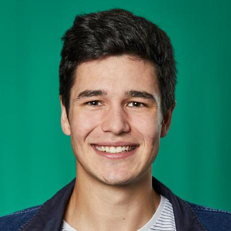

# Practical information

The agenda of the tutorial will be as follows:

* **Place**: Polytechnico di Torino
* **Time**: Friday, September 22nd 2023, afternoon (GMT+1)

# Abstract

With significant advantages upon run time, resource usage, and complexity, online machine learning and stream clustering algorithms are playing a critical role in data science. Besides substantial resource advantages, these algorithms achieve a comparable performance to traditional batch machine learning methods. This tutorial will first surveys online machine learning and data stream clustering. With the emergence of fairness and interpretability, we will also discuss certain attempts in inducing a fair and interpretable machine learning model for data streams. We will then put the tutorial into a practical context with `River`, a Python library resulted from a merge between `Creme` and `scikit-multiflow`. We will also illustrate `River` as a go-to platform for online machine learning development by providing a guidance on how to integrate an algorithm with a clear workflow, alongside actual examples of past problems and solutions during the development process.
    
Besides, during this tutorial, state-of-the-art algorithms, associated core research approaches, and future directions of data stream clustering will be presented. Truly incremental clustering validity indices will also be mentioned as an important part of the stream clustering process and will be investigated thoroughly. Currently available metrics require the information of all past points, which is impractical for unlimited data streams. `River` is the first package to design and deploy such incremental indices. 
    
Last but not least, the tutorial will demonstrate the use of `River` and the associated clustering module in real-world scenarios. From this, we propose methods of clustering configuration, hyper-parameter tuning, applications and settings for benchmarking using real-world problems and datasets. Preliminary benchmarking results will also be provided to showcase the advantages and consistency in the performance of implemented algorithms.

# Motivation

Having algorithms at hand that can process data that arrives continuously in the form of data streams is crucial. 
Online Learning potentially has to deal with real-time data rather than previously known data sets. 
To deal with the evaluation and application of models on data streams, Bifet et al. [5] defined the online learning requirements as follows:
  - Process an instance at a time, and inspect it (at most) once.
  - Use a limited amount of time to process each instance.
  - Use a limited amount of memory.
  - Be ready to give an answer (e.g. prediction) at any time
  - Adapt to temporal changes.

The following figure depicts how an online learning framework is able to comply with the data stream requirements for supervised learning tasks. 
The model processes labeled data points $\left(\overrightarrow{x},y\right)$ by updating the model while instead predicting a label $\hat{y}$ for each unlabeled instance $\overrightarrow{x}$. 
Thus, the model processes each instance from an evolving data stream, updates the underlying model, and is ready to predict at any time. 

Even until now, the development of stream algorithms is quite scattered and decentralized. Previously, algorithms were usually self-developed and maintained by the respective authors in various different programming languages, with none of the existing frameworks being widely adopted within the online learning community. Currently, `River` is becoming not only a go-to library for online machine learning tasks, but also a pioneer framework for the implementation of any new algorithm within the field.

<figure>
  
  <figcaption><strong>Figure 1</strong>: Structure of the interaction between data stream and prediction model.</figcaption>
</figure>

A significant question in the context of the advancement of `River` is whether deep learning algorithms, which have been a staple in many batch learning frameworks for some time, can also fulfill the requirements and therefore be applied within online learning environments. To this end, we developed `deep-river` which combines the `River` API for online learning algorithms and `PyTorch` for the flexible development of neural architectures.
Based on `River` and the newly developed framework `deep-river`, we present in this tutorial the chances and pitfalls for online deep learning by 
- addressing the online learning requirements, 
- the `River` API and discussing their 
- applicability in deep learning architectures. 

The tutorial will cover the transition from simple conventional machine learning models to sophisticated neural architectures while considering not only classification, regression and anomaly detection metrics, but also time and memory consumption which are key factors for the throughput of the underlying model.

# Presenters' bibliography

The following authors will be in-person presenters, i.e., tutors who will attend ECML-PKDD 2023 and present part of the tutorial: **Cedric Kulbach**, **Lucas Cazzonelli**, **Hoang-Anh Ngo**, **Minh-Huong Le-Nguyen** and **Albert Bifet**.

{: .image-left } 

**Cedric Kulbach** studied industrial engineering at the Karlsruhe Institute of Technology (KIT) with a focus on operations research and simulation, and at the Institut Polytechnique de Grenoble (INP) with a focus on product development. He wrote his master's thesis on the integrated simulation and optimisation of supply networks using the example of Bugatti Automobiles S.A.S. in collaboration with the Institute of Materials Handling and Logistics Systems (IFL), the Institut Polytechnique de Grenoble and Bugatti Automobiles S.A.S..

Since August 2018, he has been working in the Information Process Engineering (IPE) research area and is mainly involved in the topics of automated machine learning, pipeline learning and its possibilities for personalization and data stream learning.

 

{: .image-left } 

**Lucas Cazzonelli** is a research assistant at the department of knowledge management of FZI Research Center for Information Technology in Germany. As part of his research, he mainly investigates the adaptation of deep learning approaches to evolving data environments. In this context, he also contributed to the `deep-river` online deep learning framework as a co-developer, where his involvement is focused on anomaly detection techniques.

 

{: .image-left } 

**Hoang-Anh Ngo** is currently supported by the AI Institute and the School of Computing and Mathematical Sciences, University of Waikato under an External Study Award (ESA) to support his research on `River`, the machine learning library in Python for data streams. 

His research interests lies in the field of machine learning for evolving data stream, particularly in online clustering and classification algorithms. Previously, he joined the team of IT Specialists in COVID-19 task force, formed by the Ministry of Health of Vietnam as a Epidemiological Modelling Unit head.

 

{: .image-left } 

**Minh-Huong Le-Nguyen** is a third-year doctoral student at LCTI, Télécom Paris, Institut Polytechnique de Paris in France. Her doctoral research focuses on the applications of machine learning on data streams to implement predictive maintenance in the railway industry. She received her Bachelor’s degree in Computer Science at University Pierre and Marie Curie (France) in 2013, then she graduated from Télécom Paris with a Master’s degree in Data Science in 2019.

 

{: .image-left } 

**Albert Bifet** is a Professor of AI and the DIrector of the Te Ipu o te Mahara AI Institute  at University of Waikato, and Professor of Big Data at Data, Intelligence and Graphs (DIG) LTCI, Télécom Paris. Problems he investigate are motivated by large scale data, the Internet of Things (IoT), and Big Data Science. He co-leads the open source projects MOA (Massive On-line Analysis), Apache SAMOA (Scalable Advanced Massive Online Analysis) and StreamDM.

Website: [https://albertbifet.com/](https://albertbifet.com/)

# Presenters' contact information

### Cedric Kulbach

&nbsp; FZI Research Center for Information Technology, Karlsruhe, Germany

&nbsp; Email: [kulbach@fzi.de](mailto:kulbach@fzi.de)

### Lucas Cazzonelli

&nbsp; FZI Research Center for Information Technology, Karlsruhe, Germany

&nbsp; Email: [cazzonelli@fzi.de](mailto:cazzonelli@fzi.de)

### Hoang-Anh Ngo

&nbsp; Artificial Intelligence Institute, University of Waikato, Hamilton, New Zealand

&nbsp; Email: [h.a.ngo@sms.ed.ac.uk](mailto:h.a.ngo@sms.ed.ac.uk)

### Minh-Huong Le Nguyen

&nbsp; LCTI, Télécom Paris, Institut Polytechnique de Paris, France

&nbsp; Email: [minh.lenguyen@telecom-paris.fr](mailto:minh.lenguyen@telecom-paris.fr)

### Albert Bifet

&nbsp; Artificial Intelligence Institute, University of Waikato, Hamilton, New Zealand and LCTI, Télécom Paris, Institut Polytechnique de Paris, France

&nbsp; Email: [abifet@waikato.ac.nz](mailto:abifet@waikato.ac.nz)

# Outline

The tutorial is held within **4 hours** (with a **30-minute break** between the two sections) and is intended to be a combination between a **lecture-style tutorial** and a **hands-on tutorial**, with a strong emphasis on **practical demonstrations** and **benchmarking**. The detailed schedule and the topics covered within the tutorial are all depicted in section [Detailed schedule](#detailed-schedule).

All material covered within the tutorial, including lecture slides and practical demos, will be publicly available in advance on a dedicated website. Moreover, within the tutorial, these examples will be run in real-time. If the attendees want to work along, a laptop would be necessary.

Last but not least, no specific operating system, software or tool is required apart from a working Python installation with version later than or equal to 3.8. Both `River`, `deep-river` and their dependencies can easily be installed using the package manager `pip`, which we will also be briefly walk through within the tutorial. 

## Detailed schedule

The schedule of this tutorial can be divided into two parts. 

  - In the first part, we introduce data stream machine learning as well as the `River` framework. This part is depicted in more detail in [the following subsection](#introduction-to-data-stream-online-machine-learning-and-river-labelsubsubsecoutlineriver).
  - In the second part, we present the transition from traditional machine learning on data streams to online deep learning, taking into account the requirements stated in the first part of the tutorial. We depict a detailed description of the second part within [this section](#introduction-to-online-deep-learning-and-deep-river).

In the following, we present a detailed schedule of the Framework.

1. Introduction to data stream (online) machine learning and `River` (approximately **120 min**):
    1. Why do we need stream machine learning? (**5 min**) What are the differences, advantages and disadvantages of online machine learning compared to traditional machine learning methods? (**10 min**)
    1. What are the methods to induce fairness in online machine learning? (**30 min**)
    1. How can a data stream machine learning model be interpreted? (**30 min**)
    1. A brief introduction to `River` (**5 min**):
      - How was `River` created as a merge between `Creme` and `scikit-multiflow`?
      - `River`'s design principles
      - Major advantages of `River` towards previously available frameworks
      - Updates/improvements throughout each version.
    1. What steps are required to develop/implement a model within `River`? (**5 min**)
    1. From nowcasting to forecasting in online learning. (**5 min**)
    1. Demos and examples of previous problems and solutions during the development progress (**10 min**)
    1. Live visualization and benchmarking of stream algorithms and their results in synthetic and real-life scenarios. (**20 min**)
1. Introduction to online deep learning and `deep-river` (approximately **90 min**):l
    1. How do deep learning models follow the online learning Requirements~\ref{rq:online_learning}? (**5 min**)
    1. How do we cover all machine learning tasks from `River` with deep learning models? (**15 min**)
    1. A brief introduction into the deep learning extension and the framework. (**20 min**)
      - How does `deep-river` follow the `River` design principles. (**10 min**)
      - How is `PyTorch` integrated into the `River` API. (**10 min**)
    1. Chances and pitfalls of online deep learning (**50 min**): 
      - To what extent does architecture influence model performance? From nowcasting to forecasting in online deep learning. (**10 min**)
      - How does the integration of `PyTorch` influence the models throughput? (**10 min**)
      - Does the usage of GPUs increase the throughput of the deep learning model? (**30 min**)

## Introduction to data stream (online) machine learning and `River`

We will begin the tutorial by explaining the motivation and necessity of data stream machine learning, which offers a significant advantage compared to traditional machine learning methods when dealing with particularly large or infinite amounts of data with constrained time and resources.

The motivation will lead into the creation of `River`, a merge between `Creme` and `scikit-multiflow`. `River` is becoming more and more of a go-to toolkit in the field, with various advantages and many more features offered compared to its competitors. In addition to introducing the fundamental concepts of the framework, we will also provide detailed guidance on how to contribute to `River` and teach the participants how to integrate `River` into their research. 

Last but not least, we will present a comprehensive overview, along with the latest research interests in fairness and interpretability of online machine learning models. 
Due to the fact that stream machine learning models are designed to handle an infinite amount of information while having to preserve accuracy under concept drifts, this is a much younger yet more challenging and interesting research field compared to that of traditional machine learning methods. 

## Introduction to online deep learning and `deep-river`

This part will be the main part of the tutorial. 
We will motivate the development of `deep-river` by showing how deep learning models follow the online learning requirements and what adaptations need to be made for classification and regression tasks in supervised learning as well as anomaly detection with autoencoders in an unsupervised learning setting.
An example for such an adaptation is that the usually static architecture of a neural network classifier needs to be adapted to the emergence of previously unseen classes. 
This is due to the fact that in an online learning scenario the total number of classes may not be known at the time of network initialization.

After stating the conceptual specifics for the use of neural networks on evolving data streams, we will look at the implementation of `deep-river` and show how `PyTorch` models can be integrated into the `River` API. To illustrate the chances and challenges of online deep learning, we will provide a demonstration of the transition from classical machine learning to deep learning models based on an example data set.

# Target audience

The target audience of the tutorial includes any researchers and practitioners with interests in machine learning for big data, evolving data streams and IoT applications.

Basic knowledge of traditional- as well as deep- batch machine learning algorithms and frameworks (e.g. `Scikit-learn`, `TensorFlow`, `PyTorch`) would be helpful. 
Previous interactions with online machine learning packages/tools, for example `MOA` (in Java), `stream` in `R`, `scikit-multiflow`, `Creme` or `River` could also be beneficial but are not required.

For any developer who wants to contribute to `River` or `deep-river`, or employ either of these two packages within their research work, we recommend a high level of familiarity with version control via `Git`, functionalities of `GitHub` (e.g. pull requests, issues, a discussion, GitHub Actions) and code formatters in Python (`flake8`, `black`, `isort`, etc.).

# Prior offerings

Up to date, to the authors' knowledge, there has been **no** presented tutorial involving either of the following elements:

- A detailed investigation into the problem of fairness and interpretability of online machine learning algorithms in general. This will be the main emphasis in our introduction to data stream machine learning, accounting for approximately **50%** of the first part of the tutorial.
- In-depth demonstrations of the developing process i.e. on how to develop new algorithms within `River`, `deep-river` and how actual previous problems and solutions during the process were resolved.

  This will be followed up by a presentation of the development  and maintenance roadmap of the framework, which is one of the most crucial parts of any open-source projects.
    
  In other words, this tutorial will be more aimed at developers. 
- The topic of online deep learning will be investigated thoroughly, not only as a literature survey but it is also put into practical contexts, using `deep-river`. This also serves as the first formal introduction to the software package since its inaugural version in late August 2022.

Previously, there has been only **two** editions of a tutorial briefly that briefly introduced stream machine learning and `River`'s related use cases, including:

- First offering:
  - **Title:** Online Clustering: Algorithms, Evaluation, Metrics, Applications and Benchmarking using River.
  - **Conference:** The 26th Pacific - Asia Conference on Knowledge Discovery and Data Mining (PAKDD 2022).
  - **Time and location:** May 16th, 2022, Chengdu, China (presented remotely due to COVID-19 restrictions).
  - **Number of participants:** Unknown. Due to the COVID-19 prevention measures and time differences, the tutorial is presented online with a pre-recorded video.      
- Second offering:
  - **Title:** Online Clustering: Algorithms, Evaluation, Metrics, Applications and Benchmarking.
  - **Conference:** The 28th ACM SIGKDD Cofnerence on Knowledge Discovery and Data Mining (KDD '22).
  - **Type:** Lecture-style tutorial.
  - **Content:** Publicly available within [the tutorial's website](https://hoanganhngo610.github.io/river-clustering.kdd.2022/) and [the conference's proceedings](https://dl.acm.org/doi/10.1145/3534678.3542600). Within the [Related materials](https://hoanganhngo610.github.io/river-clustering.kdd.2022/related-materials.html) part of the tutorial's website, all related information can be found, including presentation slides, demos and source code.
  - **Time and location:** August 14th, 2022, Washington DC Convention Center, Washington, DC, United States.
  - **Number of participants:** Approximately 50 participants.

However, the proposed tutorial will be of a total difference from the two editions mentioned previously, regarding both the content and level of practical detail. This will also be the **first time/edition** that this tutorial will be presented.

# Related materials

For all related materials, including presentation slides, demos, source code, related papers and any other piece of information, please visit [this page](./related-materials.html).

# Citation

TBA

# References

1. Martin Abadi, Andy Chu, Ian Goodfellow, H. Brendan McMahan, Ilya Mironov, Kunal Talwar, and Li Zhang. Deep Learning with Differential Privacy. In *Proceedings of the 2016 ACM SIGSAC Conference on Computer and Communications Security*, CCS ’16, pages 308–318, New York, NY, USA, October 2016. Association for Computing Machinery.
1. Rahaf Aljundi, Lucas Caccia, Eugene Belilovsky, Massimo Caccia, Min Lin, Laurent Charlin, and Tinne Tuytelaars. Online Continual Learning with Maximally Interfered Retrieval, October 2019.
1. Rahaf Aljundi, Min Lin, Baptiste Goujaud, and Yoshua Bengio. Gradient based sample selection for online continual learning, October 2019.
1. Atilim Gunes Baydin, Robert Cornish, David Martínez-Rubio, Mark Schmidt, and Frank Wood. Online learning rate adaptation with hyper-gradient descent. In *6th international conference on learning representations, ICLR 2018, vancouver, BC, canada, april 30 - may 3, 2018, conference track proceedings*. OpenReview.net, 2018. tex.bibsource: dblp computer science bibliography, [https://dblp.org](https://dblp.org) tex.biburl: [https://dblp.org/rec/conf/iclr/BaydinCMSW18.bib](https://dblp.org/rec/conf/iclr/BaydinCMSW18.bib) tex.timestamp: Thu, 23 Apr 2020 11:53:22 +0200.
1. Albert Bifet, Ricard Gavaldà, Geoff Holmes, and Bernhard Pfahringer. *Machine Learning for Data Streams with Practical Examples in MOA*. MIT Press, 2018.
1. Nadia Burkart and Marco F. Huber. A Survey on the Explainability of Supervised Machine Learning. *Journal of Artificial Intelligence Research*, 70:245–317, January 2021.
1. Pietro Buzzega, Matteo Boschini, Angelo Porrello, Davide Abati, and Simone Calderara. Dark Experience for General Continual Learning: A Strong, Simple Baseline, October 2020.
1. Nicholas Carlini and David Wagner. Towards Evaluating the Robustness of Neural Networks. In *2017 IEEE Symposium on Security and Privacy (SP)*, pages 39–57, May 2017.
1. Jacob Devlin, Ming-Wei Chang, Kenton Lee, and Kristina Toutanova. BERT: Pre-training of Deep Bidirectional Transformers for Language Understanding. In *Proceedings of the 2019 Conference of the North American Chapter of the Association for Computational Linguistics: Human Language Technologies, Volume 1 (Long and Short Papers)*, pages 4171–4186, Minneapolis, Minnesota, June 2019. Association for Computational Linguistics.
1. João Gama, Pedro Medas, Gladys Castillo, and Pedro Rodrigues. Learning with drift detection. In Ana L. C. Bazzan and Sofiane Labidi, editors, *Advances in Artificial Intelligence – SBIA 2004*, pages 286–295, Berlin, Heidelberg, 2004. Springer Berlin Heidelberg.
1. Heitor Murilo Gomes, Jesse Read, and Albert Bifet. Streaming random patches for evolving data stream classification. In *2019 IEEE International Conference on Data Mining (ICDM)*, pages 240–249, 2019.
1. Heitor Murilo Gomes, Jesse Read, Albert Bifet, Jean Paul Barddal, and João Gama. Machine learning for streaming data: State of the art, challenges, and opportunities. *SIGKDD Explor. Newsl.*, 21(2):6–22, nov 2019.
1. Max Halford, Geoffrey Bolmier, Raphael Sourty, Robin Vaysse, and Adil Zouitine. creme, a Python library for online machine learning, 2019.
1. Kaiming He, Xinlei Chen, Saining Xie, Yanghao Li, Piotr Dollar, and Ross Girshick. Masked Autoencoders Are Scalable Vision Learners. In *2022 IEEE/CVF Conference on Computer Vision and Pattern Recognition (CVPR)*, pages 15979–15988, New Orleans, LA, USA, June 2022. IEEE.
1. Steven C. H. Hoi, Doyen Sahoo, Jing Lu, and Peilin Zhao. Online Learning: A Comprehensive Survey, October 2018.
1. Kurt Hornik, Maxwell Stinchcombe, and Halbert White. Multilayer feedforward networks are universal approximators. *Neural Networks*, 2(5):359–366, January 1989.
1. Lakhmi C. Jain, Manjeevan Seera, Chee Peng Lim, and P. Balasubramaniam. A review of online learning in supervised neural networks. *Neural Computing and Applications*, 25(3-4):491–509, September 2014.
1. James Kirkpatrick, Razvan Pascanu, Neil Rabinowitz, Joel Veness, Guillaume Desjardins, Andrei A. Rusu, Kieran Milan, John Quan, Tiago Ramalho, Agnieszka Grabska-Barwinska, Demis Hassabis, Claudia Clopath, Dharshan Kumaran, and Raia Hadsell. Overcoming catastrophic forgetting in neural networks. *Proceedings of the National Academy of Sciences*, 114(13):3521–3526, March 2017.
1. Alex Krizhevsky, Ilya Sutskever, and Geoffrey E Hinton. ImageNet Classification with Deep Convolutional Neural Networks. In *Advances in Neural Information Processing Systems*, volume 25. Curran Associates, Inc., 2012.
1. Zhizhong Li and Derek Hoiem. Learning without Forgetting. *IEEE Transactions on Pattern Analysis and Machine Intelligence*, 40(12):2935–2947, December 2018.
1. Jesus L Lobo, Javier Del Ser, Albert Bifet, and Nikola Kasabov. Spiking neural networks and online learning: An overview and perspectives. *Neural Networks*, 121:88–100, 2020. Publisher: Elsevier.
1. Scott Lundberg and Su-In Lee. A Unified Approach to Interpreting Model Predictions, November 2017.
1. Aleksander Madry, Aleksandar Makelov, Ludwig Schmidt, Dimitris Tsipras, and Adrian Vladu. Towards Deep Learning Models Resistant to Adversarial Attacks, September 2019.
1. Michael McCloskey and Neal J. Cohen. Catastrophic Interference in Connectionist Networks: The Sequential Learning Problem. In *Psychology of Learning and Motivation*, volume 24, pages 109–165. Elsevier, 1989.
1. Jacob Montiel, Jesse Read, Albert Bifet, and Talel Abdessalem. Scikit-multiflow: A multi-output streaming framework. *Journal of Machine Learning Research*, 19(72):1–5, 2018.
1. Jacob Montiel, Max Halford, Saulo Martiello Mastelini, Geoffrey Bolmier, Raphael Sourty, Robin Vaysse, Adil Zouitine, Heitor Murilo Gomes, Jesse Read, Talel Abdessalem, and Albert Bifet. River: machine learning for streaming data in python. *Journal of Machine Learning Research*, 22:1–8, April 2021. 
1. Jacob Montiel, Hoang-Anh Ngo, Minh-Huong Le-Nguyen, and Albert Bifet. Online clustering: Algorithms, evaluation, metrics, applications and benchmarking. In *Proceedings of the 28th ACM SIGKDD Conference on Knowledge Discovery and Data Mining*, KDD ’22, page 4808–4809, New York, NY, USA, 2022. Association for Computing Machinery. 
1. Jordan Pearson and Yoshua Bengio. When AI Goes Wrong, We Won’t Be Able to Ask It Why, July 2016. 
1. Anand Rajaraman and Jeffrey David Ullman. *Data Mining*, page 1–17. Cambridge University Press, 2011. 
1. Marco Tulio Ribeiro, Sameer Singh, and Carlos Guestrin. ”Why Should I Trust You?”: Explaining the Predictions of Any Classifier, August 2016. 
1. David E. Rumelhart, Geoffrey E. Hinton, and Ronald J. Williams. Learning representations by back-propagating errors. *Nature*, 323(6088):533–536, October 1986. 
1. Doyen Sahoo, Quang Pham, Jing Lu, and Steven C. H. Hoi. Online Deep Learning: Learning Deep Neural Networks on the Fly. In *IJCAI Proceedings*, pages 2660–2666, Stockholm, Sweden, July 2018. International Joint Conferences on Artificial Intelligence Organization. 
1. Sheng Wan and L.E. Banta. Parameter Incremental Learning Algorithm for Neural Networks. IEEE *Transactions on Neural Networks*, 17(6):1424–1438, November 2006. 
1. Jonathan A. Silva, Elaine R. Faria, Rodrigo C. Barros, Eduardo R. Hruschka, Andr ́e C. P. L. F. de Carvalho, and João Gama. Data stream clustering: A survey. *ACM Comput. Surv.*, 46(1), jul 2013. 
1. David Silver, Aja Huang, Chris J. Maddison, Arthur Guez, Laurent Sifre, George van den Driessche, Julian Schrittwieser, Ioannis Antonoglou, Veda Panneershelvam, Marc Lanctot, Sander Dieleman, Dominik Grewe, John Nham, Nal Kalchbrenner, Ilya Sutskever, Timothy Lillicrap, Madeleine Leach, Koray Kavukcuoglu, Thore Graepel, and Demis Hassabis. Mastering the game of Go with deep neural networks and tree search. *Nature*, 529(7587):484–489, January 2016. 
1. Christian Szegedy, Wojciech Zaremba, Ilya Sutskever, Joan Bruna, Dumitru Erhan, Ian Goodfellow, and Rob Fergus. Intriguing properties of neural networks, February 2014. 
1. Vladimir Vapnik. *The Nature of Statistical Learning Theory*. Springer Science & Business Media, November 1999. 
1. Pascal Vincent, Hugo Larochelle, Isabelle Lajoie, Yoshua Bengio, and Pierre-Antoine Manzagol. Stacked Denoising Autoencoders: Learning Useful Representations in a Deep Network with a Local Denoising Criterion. *Journal of Machine Learning Research*, page 38, 2010.
1. Guanyu Zhou, Kihyuk Sohn, and Honglak Lee. Online Incremental Feature Learning with Denoising Autoencoders. In *AISTATS Proceedings*, 2012.